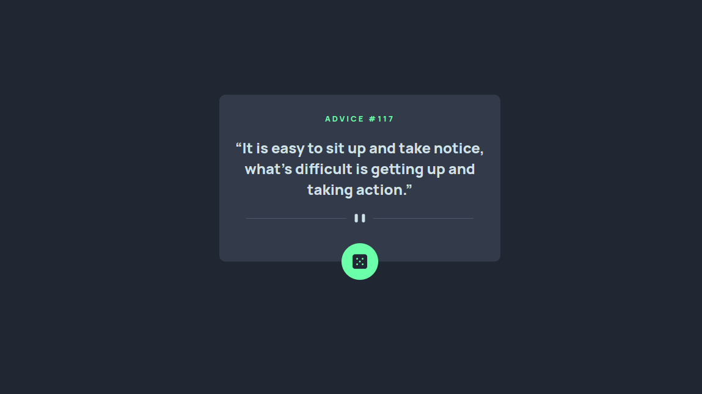

# Frontend Mentor - Advice generator app solution

This is a solution to the [Advice generator app challenge on Frontend Mentor](https://www.frontendmentor.io/challenges/advice-generator-app-QdUG-13db).

## Table of contents

- [Overview](#overview)
  - [The challenge](#the-challenge)
  - [Screenshot](#screenshot)
  - [Links](#links)
- [My process](#my-process)
  - [Built with](#built-with)
  - [What I learned](#what-i-learned)
  - [Useful resources](#useful-resources)
- [Author](#author)

## Overview

### The challenge

Users should be able to:

- View the optimal layout for the app depending on their device's screen size
- See hover states for all interactive elements on the page
- Generate a new piece of advice by clicking the dice icon

### Screenshot



### Links

- Solution URL: [Add solution URL here](https://github.com/kondzerau-ivan/advice-generator-app-main)
- Live Site URL: [Add live site URL here](https://kondzerau-ivan.github.io/advice-generator-app-main/)

## My process

### Built with

- Semantic HTML5 markup
- CSS custom properties
- Flexbox
- Mobile-first workflow
- Vanila JavaScript

### What I learned

The best way to understand JavaScript asynchronous concepts and web browsers' APIs is through practice. Therefore, in this challenge, I have used not only the Fetch API but also the async/await syntax to work with the Promise object. This has helped me write code in a more organized way and avoid the need to manually configure promise chains.

```js
async function getAdvice() {
  try {
    const response = await fetch('https://api.adviceslip.com/advice');
    const data = await response.json();
    return data;
  } catch (error) {
    alertError(error);
  }
}
```

### Useful resources

- [Дока U•ᴥ•U](https://doka.guide/js/fetch/) - This is an amazing article which helped me for bettter understanding of FetchAPI.
- [MDN 💁‍♂️](https://developer.mozilla.org/en-US/docs/Web/API/Fetch_API/Using_Fetch) - FetchAPI.

## Author

- Website - [GitHub](https://github.com/kondzerau-ivan)
- Frontend Mentor - [@kondzerau-ivan](https://www.frontendmentor.io/profile/kondzerau-ivan)
- LinkedIn - [Ivan Kondzerau](https://www.linkedin.com/in/ivan-kondzerau/)
